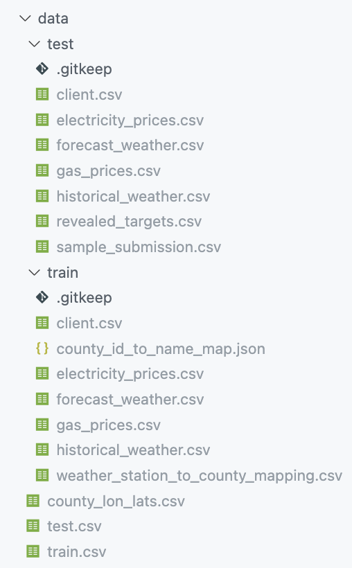

<ul align="center">
</ul>

# Original dataset placement
+ for running this project, you can download files from below
  + [kaggle-competition: predict-energy-behavior-of-prosumers](https://www.kaggle.com/competitions/predict-energy-behavior-of-prosumers)
  + [additional-data: county-mapper](https://www.kaggle.com/datasets/michaelo/fabiendaniels-mapping-locations-and-county-codes)
+ after downloading the files, please places them as follow

&nbsp;&nbsp;&nbsp;&nbsp;&nbsp;&nbsp;&nbsp;&nbsp;&nbsp;


# configs/prepocess_config .py  
+ contains a config for preprocess.py

## Variables with a fixed value - **DO NOT CHANGE**
+ **ROOT_PATH** : absolute path to `est_wassup_02` = get_root_path()

+ **TARGET_COL** : name of column which to make a prediction = "target" 
+ **INDEX_COL** : name of index column = "datetime"
+ **TST_INDEX_COL** : name of index column for test data csv = "prediction_datetime"

+ **USE_DROP_COLS** : whether to filter dataset columns with `drop_x_cols` or `use_x_cols`  = True
+ **DROP_X_COLS** : drop columns if exists = \["currently_scored"]
+ **USE_X_COLS** : use only the following columns = []

+ **FILL_NUM_STRATEGY** : function which is used for replacing `NaN` values = fill_num_strategy("custom_mean")

+ **SCALER** : avaliable data scalers = {<br/>
  "standard": StandardScaler,<br/>
  "minmax": MinMaxScaler,<br/>
  "maxabs": MaxAbsScaler,<br/>
  "robust": RobustScaler,<br/>
}

## Variables that are adjustable
+ **ROW_QUERY** = {<br/>
  "prediction_unit_id": 0, # prediction_unit_id to make a prediction<br/>
  "is_consumption": 0 # whether to make a prediction for consumption data or production data<br/>
}
+ **USE_ARIMA** : whether to use target column and index only
+ **SELECTED_X_SCALER** : scaler selection for X features - if unwanted, please set this variable to None = SCALER\["minmax"]()
+ **SELECTED_Y_SCALER** : scaler selection for Y features = None
+ **DROP_COLS_AFTER_MERGE** : columns to drop - this is applied at the final result of merging additional datasets
  + for using **full dataset**, set this variable as follow : <br/>
  ```
  [ "county", "is_business", "is_consumption", "product_type", "row_id", "date", "date_client", "forecast_date_electricity", "origin_date_electricity", "forecast_date_gas", "origin_date_gas", "prediction_unit_id" ]
  ```
  + for using **partially selected dataset**, you can **add column names** from below **to full dataset value listed above**:
  ```
  [ "year", "quarter", "month", "week",  "day", "hour",
  "day_of_year", "day_of_month", "day_of_week", "eic_count_client",
  "installed_capacity_client", "temperature_h_mean", 
  "dewpoint_h_mean",
  "rain_h_mean", "snowfall_h_mean", "surface_pressure_h_mean",
  "cloudcover_total_h_mean", "cloudcover_low_h_mean",
  "cloudcover_mid_h_mean", "cloudcover_high_h_mean",
  "windspeed_10m_h_mean", "winddirection_10m_h_mean",
  "shortwave_radiation_h_mean", "direct_solar_radiation_h_mean",
  "diffuse_radiation_h_mean", "hour_h", "hours_ahead_f_mean",
  "temperature_f_mean", "dewpoint_f_mean", "cloudcover_high_f_mean",
  "cloudcover_low_f_mean", "cloudcover_mid_f_mean",
  "cloudcover_total_f_mean", "10_metre_u_wind_component_f_mean",
  "10_metre_v_wind_component_f_mean", "direct_solar_radiation_f_mean",
  "surface_solar_radiation_downwards_f_mean", "snowfall_f_mean",
  "total_precipitation_f_mean", "euros_per_mwh_electricity",
  "lowest_price_per_mwh_gas", "highest_price_per_mwh_gas",
  "mean_price_per_mwh_gas", "country_holiday" ]
  ```

# configs/train_configs.py
+ contains a config for train.py
+ train.py is for running ANN model

## Variables with a fixed value - **DO NOT CHANGE**
+ **ROOT_PATH** : absolute path to `est_wassup_02` = get_root_path()
+ **METRIC** : used for calculating mae, mape, r2 score = F.l1_loss
+ **MODEL** : network class used for trian = ANN

## Variables that are adjustable
+ **EXPERIMENT_NAME** : name of experiment where is going to be the name of a folder(directory) of outputs<br/><br/>
+ **EPOCHS** : train epochs
+ **LEARNING_RATE** : learning rate
+ **BATCH_SIZE** : batch size
+ **LOSS_FUNC** : loss function
+ **OPTIM** : optimizer<br/><br/>
+ **TEST_SIZE** : size of total hours to be predicted
+ **PRED_SIZE** : whether to make a prediction dynamically<br/><br/>
+ **WINDOW_SIZE** : window size
+ **ACTIVATION_FUNC** : activation function
+ **HIDDEN_DIM** : hidden dimensions = [128, 64]
+ **USE_DROP** : whether to use drop out = True
+ **DROP_RATIO** : drop out ratio = 0.3
+ **OUTPUT_FUNC** : output layer function.
  + This should be selected depends on the y scaler which is used for data preprocessing.
  + If y scaler is not used for data processing, please set the value as follow = `lambda x: x`
+ **USE_SCHEDULER** : whether to use LR scheduler = False
+ **SCHEDULER** : LR scheduler = optim.lr_scheduler.CosineAnnealingLR
+ **SCHEDULER_PARAMS** = { # every parameters that are required for the LR scheduler<br/>
  "T_max": 50,<br/>
  "eta_min": 0.000001,<br/>
}
+ **USE_EARLY_STOP** : whether to use early stopping = True
+ **EARLY_STOP_PARAMS** = {<br/>
  "patience_limit": 20 # early stopping patience limit<br/>
}

# configs/arima_config.py
+ contains a config for train_arima.py
+ train_arima.py is for running either Arima or Sarima

## Variables with a fixed value - **DO NOT CHANGE**
+ **ROOT_PATH** : absolute path to `est_wassup_02` = get_root_path()

## Variables that are adjustable
+ **EXPERIMENT_NAME** : name of experiment where is going to be the name of a folder(directory) of outputs<br/><br/>
+ **TEST_SIZE** : size of total hours to be predicted<br/><br/>
+ **ARIMA_MODEL** : whether to use Arima or Sarima = "ARIMA" # ARIMA or SARIMA
+ **ORDER** : order parameters : p,d,q = (25, 1, 0)
+ **SEASON_ORDER** : seasonal order used for sarima : P,D,Q,S = (0, 0, 0, 24)
+ **TREND** : trend = "c"
+ **FREQ** : freq = "h"

# configs/patchtst_config.py
+ contains a config for train_patchtst.py
+ train_patchtst.py is for running Patch TST

## Variables with a fixed value - **DO NOT CHANGE**
+ **ROOT_PATH** : absolute path to `est_wassup_02` = get_root_path()
+ **TARGET_COL** : name of column which to make a prediction = "target" 
+ **METRIC** : used for calculating mae, mape, r2 score = F.l1_loss
+ **MODEL** : network class used for trian = PatchTST
+ **WINDOW_SIZE** : fixed to as follow = int(PATCH_LENGTH*N_PATCHES/2)

## Variables that are adjustable
+ **EXPERIMENT_NAME** : name of experiment where is going to be the name of a folder(directory) of outputs<br/><br/>
+ **EPOCHS** : train epochs
+ **LEARNING_RATE** : learning rate
+ **BATCH_SIZE** : batch size
+ **LOSS_FUNC** : loss function
+ **OPTIM** : optimizer<br/><br/>
+ **TEST_SIZE** : size of total hours to be predicted
+ **PRED_SIZE** : same as the test size<br/><br/>

+ **PATCH_LENGTH** : patch length = 16
+ **N_PATCHES** : number of patches = 64
+ **MODEL_DIM** : model dimension = 128
+ **NUM_HEADS** : number of heads = 8
+ **NUM_LAYERS** : number of layers = 3
+ **DIM_FEED_FORWARD** : dimension feed forward = 256<br/><br/>
+ **OUTPUT_FUNC** : output layer function.
  + This should be selected depends on the y scaler which is used for data preprocessing.
  + If y scaler is not used for data processing, please set the value as follow = `lambda x: x`
+ **USE_SCHEDULER** : whether to use LR scheduler = False
+ **SCHEDULER** : LR scheduler = optim.lr_scheduler.CosineAnnealingLR
+ **SCHEDULER_PARAMS** = { # every parameters that are required for the LR scheduler<br/>
  "T_max": 50,<br/>
  "eta_min": 0.000001,<br/>
}
+ **USE_EARLY_STOP** : whether to use early stopping = True
+ **EARLY_STOP_PARAMS** = {<br/>
  "patience_limit": 20 # early stopping patience limit<br/>
}

# auto-configs-*
+ where config files for auto-train.py goes
+ place as many config files as you want to train within one command
  + for patch tst config format, please place under `auto-configs-tst`
  + for arima/sarima config format, please place under `auto-configs-arima`
  + for ann config format, please place under `auto-configs-nn`
+ when running `auto_train.py`, make sure you change `TYPE` to either 'tst' or 'nn' or 'arima' for Patch TST auto train, ANN auto train, Arima/Sarima auto train respectively